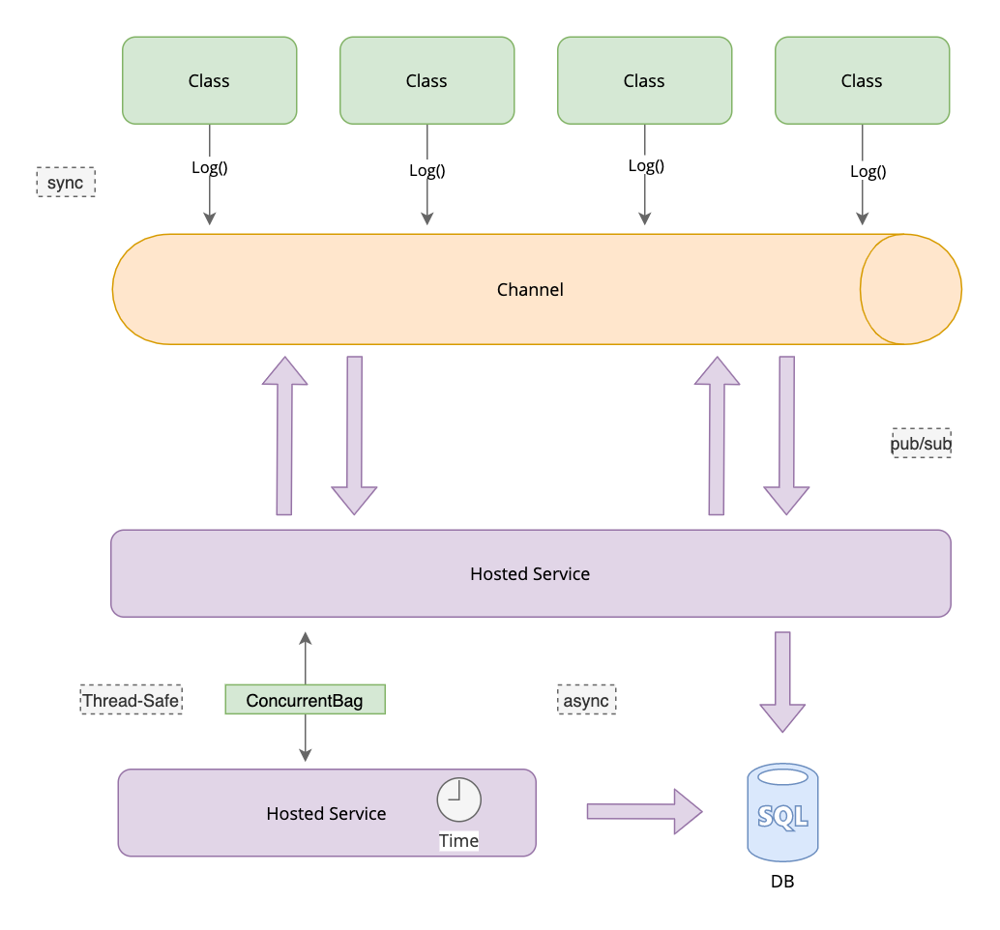

Yadl stands for Yet another dotnet logger 😅. This project is a PoC. 

The implementation is built on top of the dotnet logger using [Channels](https://devblogs.microsoft.com/dotnet/an-introduction-to-system-threading-channels/) and [System.Text.Json](https://devblogs.microsoft.com/dotnet/try-the-new-system-text-json-apis/). These features are new in .NET Core 3.0

## Architecture
Here's the architecture diagram of the component.

## Set up the database
Execute `./build.sh` or `./build.ps1` depending on your operating system to create the SQL server and begin to use the sample.
These files execute the docker container to download the SQL server image and run the necessary script to create the logs table's database.

## Limitations
It writes log records into a SQL Server Database using batch sizes or when the timer reaches the end. You can use this project to getting started to write log records wherever you want.